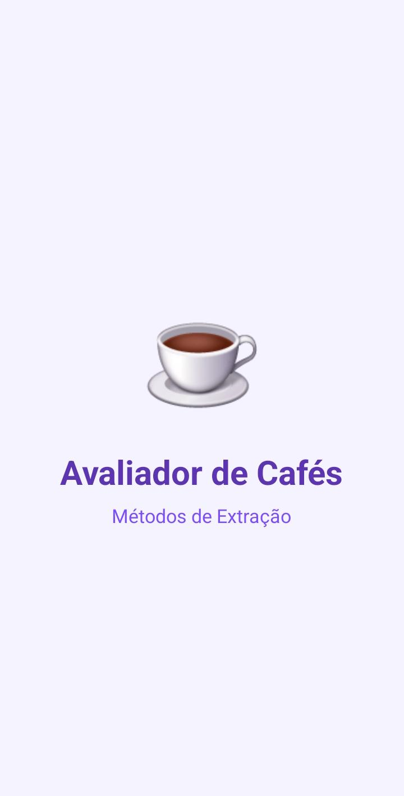
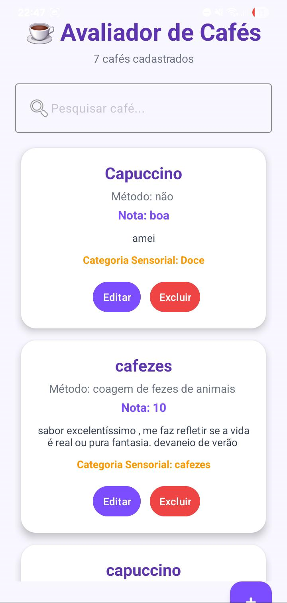
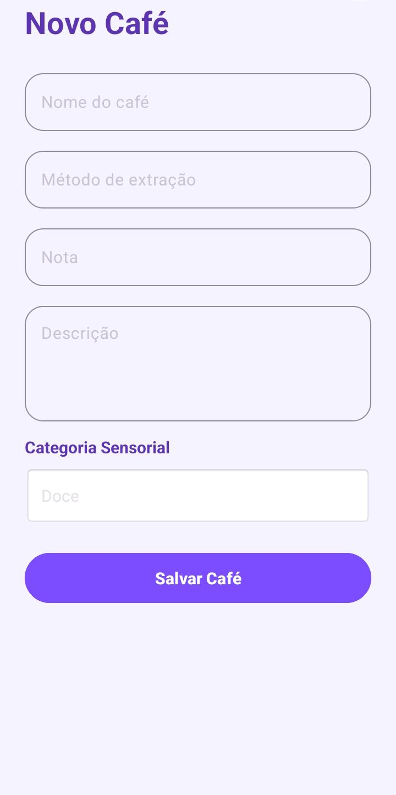
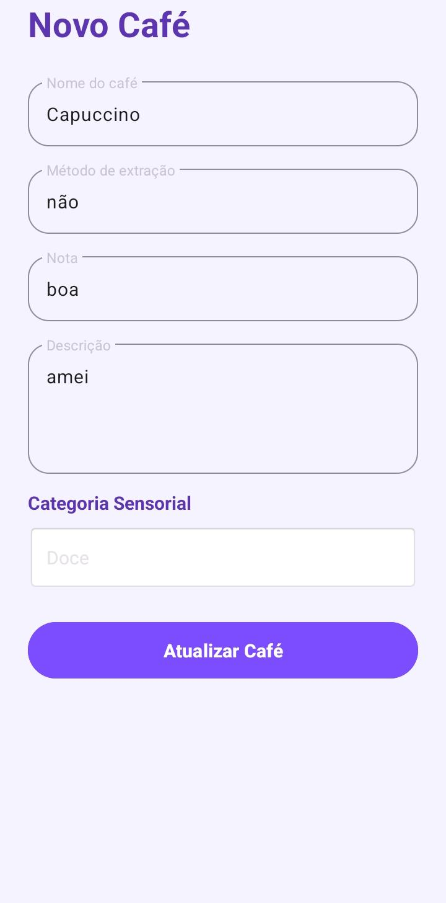

# Avaliador de Cafés

Aplicativo Android desenvolvido em Kotlin para cadastro, avaliação e gerenciamento de cafés, permitindo registrar métodos de extração, notas e características sensoriais.

---

## Status do Projeto

- Projeto funcional
- Banco de dados SQLite integrado
- Sistema de pesquisa implementado
- Splash Screen animada
- Interface desenvolvida com Material Design

---

## Desenvolvedora

Mariana Rigueiro

---

## Objetivo do Projeto

O objetivo do aplicativo é auxiliar apreciadores de café a registrarem e organizarem suas experiências de degustação.

O sistema permite cadastrar diferentes cafés, armazenar informações importantes sobre cada avaliação e consultar rapidamente os registros realizados.

---

## Tecnologias Utilizadas

- Kotlin
- Android Studio
- Room Database (SQLite)
- RecyclerView
- View Binding
- Material Design 3
- CardView

---

## Funcionalidades

### Cadastro de Cafés

O aplicativo permite registrar:

- Nome do café
- Método de extração
- Nota da avaliação
- Descrição
- Categoria sensorial

### Pesquisa

- Busca em tempo real
- Filtro por nome

### Gerenciamento

- Visualizar cafés cadastrados
- Editar avaliações
- Excluir avaliações
- Atualizar informações

### Categorias Sensoriais

- Doce
- Frutado
- Cítrico
- Chocolate
- Caramelo
- Floral

---

## Capturas de Tela

### Splash Screen



### Tela Inicial



### Cadastro de Café



### Edição de Café



---

## Como Executar o Projeto

### Clonar o Repositório

```bash
git clone https://github.com/marianarigueiro/AvaliadorCafe.git
```

### Abrir no Android Studio

1. Abra o Android Studio.
2. Clique em **Open**.
3. Selecione a pasta do projeto.

### Sincronizar o Gradle

Aguarde a sincronização automática do projeto.

### Executar o Aplicativo

1. Conecte um dispositivo Android ou abra um emulador.
2. Clique em **Run** ou pressione:

```text
Shift + F10
```

### Gerar APK

No Android Studio:

```text
Build
→ Build APK(s)
```

O APK será gerado em:

```text
app/build/outputs/apk/debug/
```

---

## Banco de Dados

O aplicativo utiliza Room Database para armazenamento local.

### Entidade Principal: Cafe

| Campo | Tipo |
|---------|---------|
| id | INTEGER |
| nome | TEXT |
| metodo | TEXT |
| nota | TEXT |
| descricao | TEXT |
| tags | TEXT |

---

## Estrutura do Projeto

```text
AvaliadorCafe/
│
├── app/
│   └── src/main/
│       ├── java/com/example/avaliadorcafe/
│       ├── res/layout/
│       ├── res/anim/
│       ├── res/values/
│       └── AndroidManifest.xml
│
├── prints/
├── README.md
├── build.gradle.kts
└── settings.gradle.kts
```

---

## Melhorias Futuras

- Ordenação por nota
- Ordenação por nome
- Favoritar cafés
- Adicionar imagens dos cafés
- Compartilhamento de avaliações
- Estatísticas de degustação
- Exportação de dados

---

## Requisitos

- Android 5.0 ou superior
- Android Studio
- Kotlin
- Gradle

---

## Licença

Projeto desenvolvido para fins acadêmicos e educacionais.

---

## Considerações Finais

O projeto Avaliador de Cafés foi desenvolvido com foco no aprendizado de desenvolvimento Android e persistência de dados.

Durante o desenvolvimento foram aplicados conceitos de:

- Kotlin
- Android Studio
- Room Database
- RecyclerView
- Material Design
- View Binding
- Persistência de dados locais
- Navegação entre Activities
- Splash Screen com animação

O resultado é um aplicativo funcional, organizado e adequado para estudos, portfólio e uso pessoal.
